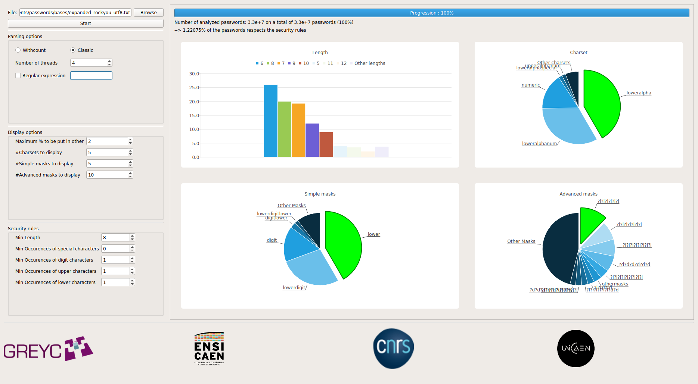

# Statistical analysis of a password list

## Requirements

A password list, encoded in UTF-8.
To convert a file to UTF-8, use the following command:
```shell
iconv -f ISO-8859-1 -t UTF-8 input.txt -o output.txt
```

## Installation

```shell
git clone https://git.unicaen.fr/passwords/cppack
cd cppack
cmake .
make
```

## Usage

To analyze a password list, use:

```shell
Usage: bin/cppack FILENAME [OPTIONS]
To be sure the database's format can be read, please use this command before:
	iconv -f ISO-8859-1 -t UTF-8 databaseInput.txt -o databaseOutput.txt
Use '-' for FILENAME to read from stdin
Options:
	--help, -h          Show this help message
	--withcount, -w     Mendatory if the input database has the following format : [number of occurence] [password]
	--hiderare, -H      Hide all statistics below 1%
	--top, -t [value]   Show only [value] first results
	--regex, -r [value] Show result for password, using the regular expression [value]
	--out, -o [value]   Writes masks into [value] file
	--debug, -d         Enable debug printing

Optimisation options to reduce the execution time : 
	--limit-advanced-masks, -A [value]  Limit the size of the advanced masks at [value], if size>[value]: othermasks
	--limit-simple-masks, -S [value]    Limit the size of the simple masks at [value], if size>[value]: othermasks
	--parallel, -p [value]              Number of usable threads


Security rules: 
	--security, -s		Define the security rules
```


## Graphical Interface

A QT GUI is available to have visual feedback of statistics.
To compile, it requires QtCharts version > 5 (available in Ubuntu repo since 18.04). This GUI has been developed using Qt 5.9.4.
Then run:
```shell
cmake .
make cppack-gui
bin/cppack-gui
```



## License

See [LICENSE](LICENSE) for licensing details.
